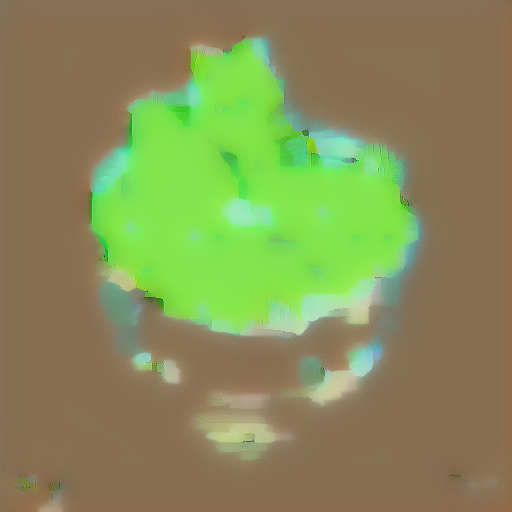
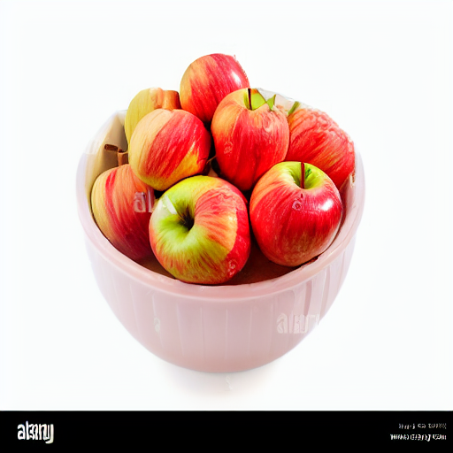

# DiffEdit

An implementation of the DiffEdit algorithm described in the paper [DiffEdit: Diffusion-based semantic image editing with mask guidance](https://arxiv.org/pdf/2210.11427).

## How It Works

DiffEdit performs semantic image editing through a two-step process:

1. **Mask Generation**: 
   - Computes a mask by denoising half the timesteps with a reference text prompt and half with an empty prompt
   - Averages the difference between the two latents over several runs to identify edit regions

2. **Guided Denoising**: 
   - Uses the generated mask to selectively apply different prompts during denoising
   - Regions within the mask are denoised using the query text prompt
   - Regions outside the mask are denoised using an empty prompt

## Implementation Details

The implementation uses the following components:
- Scheduler: Controls noise addition to latent representations
- VAE Encoder/Decoder: Converts between image and latent space
- Text Encoder: Converts text prompts to embeddings
- UNet: Performs noise prediction during the diffusion process

### Processing Steps

1. Load image from URL or path
2. Convert image to latent representation using VAE encoder
3. Add 50% gaussian noise using the scheduler
4. Remove outlier noise through clamping
5. Denoise the latent using both reference and query prompts
6. Average differences over multiple denoising runs
7. Generate binary mask using a threshold
8. Perform final denoising:
   - Take the latent representation of the original image
   - Run two parallel denoising processes:
     a. Unconditional path (empty prompt):
        - Denoise the latent with empty text prompt
        - Store intermediate results at each timestep
     b. Conditional path (query prompt):
        - Denoise the latent with query text prompt
        - At each timestep after halfway point:
          * Use query results for regions inside the mask
          * Use unconditional results for regions outside the mask
9. Decode final latent to obtain edited image

## Current Limitations

- Mask computation quality can be improved

## Future Work

- Experiment with different schedulers, UNets, and VAEs
- Investigate alternative models (e.g., Flux) for better mask generation

## Examples

Here's an example of using DiffEdit to transform strawberries into apples:

| Original Image | Generated Mask | Result |
|:-------------:|:--------------:|:------:|
|  |  |  |

**Prompts used:**
- Reference: "strawberries"
- Query: "apples"

The mask (middle image) shows the regions identified for editing, where the model transforms strawberries into apples while preserving the bowl and overall composition.
